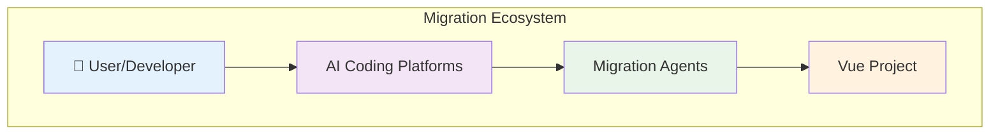
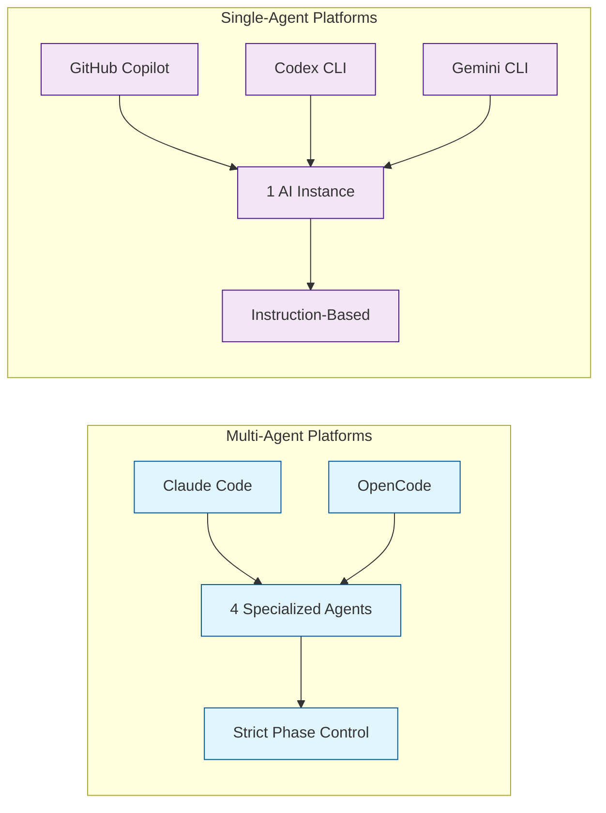
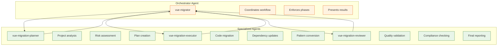
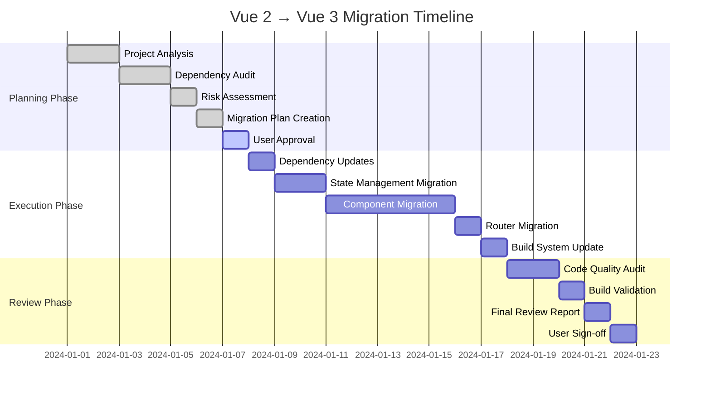
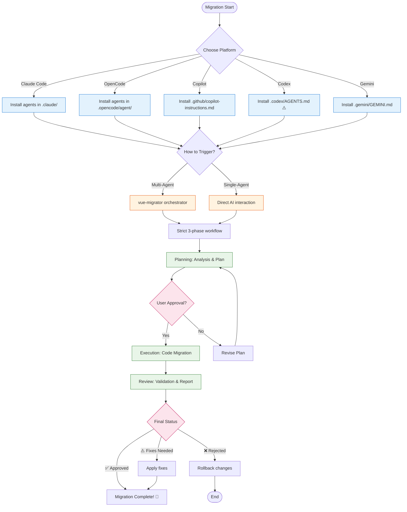
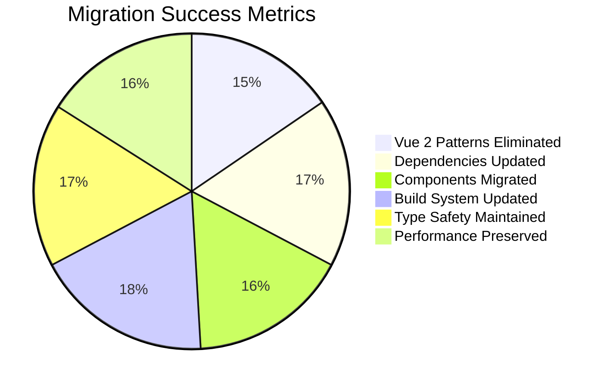

# Vue 2 → Vue 3 Migration Flow Canvas

Using canvas-design skill to create a comprehensive visual representation of the migration workflow.

## High-Level Architecture Overview



## Platform Architecture Comparison



## Complete Migration Workflow (Multi-Agent)

```mermaid
stateDiagram-v2
    [*] --> Trigger: User starts migration
    Trigger --> Planning: vue-migrator activates

    state Planning as "📋 PHASE 1: PLANNING"
    Planning --> Analysis: Invoke vue-migration-planner
    Analysis --> Document: Analyze project & create plan
    Document --> Present: Present to user

    Present --> Approval: Wait for user approval

    state Approval as "✅ USER APPROVAL GATE"
    Approval --> Execute: Approved
    Approval --> Revise: Rejected/Modified
    Revise --> Document

    state Execute as "⚙️ PHASE 2: EXECUTION"
    Execute --> Executor: Invoke vue-migration-executor
    Executor --> Migrate: Apply migration plan
    Migrate --> Progress: Report progress
    Progress --> Complete: Migration finished

    state Review as "🔍 PHASE 3: REVIEW"
    Review --> Reviewer: Invoke vue-migration-reviewer
    Reviewer --> Validate: Audit migration quality
    Validate --> Report: Generate review report
    Report --> Final: Present final results

    Final --> Success: ✅ APPROVED
    Final --> Fixes: ⚠️ APPROVE WITH FIXES
    Final --> Reject: ❌ REJECTED

    Success --> [*]
    Fixes --> [*]
    Reject --> [*]

    note right of Planning : vue-migration-planner
    note right of Execute : vue-migration-executor
    note right of Review : vue-migration-reviewer
```

## Agent Interaction Flow



## Platform-Specific Trigger Methods

```mermaid
flowchart TD
    A[User] --> B{Platform Choice}

    B --> C[Claude Code]
    C --> C1[/vue-migrate command]
    C1 --> C2[vue-migrator agent]

    B --> D[OpenCode]
    D --> D1["'migrate vue' text"]
    D --> D2[@vue-migrator mention]
    D1 --> D3[vue-migrator agent]
    D2 --> D3

    B --> E[GitHub Copilot]
    E --> E1["'migrate to Vue 3'"]
    E1 --> E2[AI with instructions]

    B --> F[Codex CLI]
    F --> F1["'migrate to Vue 3'"]
    F1 --> F2[AI with AGENTS.md]

    B --> G[Gemini CLI]
    G --> G1["'migrate to Vue 3'"]
    G1 --> G2[AI with GEMINI.md]

    C2 --> H[Multi-Agent Workflow]
    D3 --> H
    E2 --> I[Single-Agent Workflow]
    F2 --> I
    G2 --> I

    classDef trigger fill:#e3f2fd,stroke:#1976d2
    classDef multi fill:#e1f5fe,stroke:#01579b
    classDef single fill:#f3e5f5,stroke:#4a148c

    class C1,D1,D2,E1,F1,G1 trigger
    class C2,D3 multi
    class E2,F2,G2 single
```

## Migration Phase Timeline (Gantt)



## Decision Flow Matrix



## File Structure Comparison

```
📁 Multi-Agent Platforms
├── .claude/
│   ├── agents/
│   │   ├── vue-migrator.md
│   │   ├── vue-migration-planner.md
│   │   ├── vue-migration-executor.md
│   │   └── vue-migration-reviewer.md
│   └── commands/
│       └── vue-migrate.md
└── .opencode/
    └── agent/
        ├── vue-migrator.md
        ├── vue-migration-planner.md
        ├── vue-migration-executor.md
        └── vue-migration-reviewer.md

📁 Single-Agent Platforms
├── .github/
│   └── copilot-instructions.md
├── .codex/
│   └── AGENTS.md ⚠️ (NOT instructions.md)
└── .gemini/
    └── GEMINI.md
```

## Success Metrics Dashboard



## ASCII Art Summary

```
╔══════════════════════════════════════════════════════════════╗
║                    VUE 2 → VUE 3 MIGRATION                   ║
║                          FLOW CANVAS                         ║
╚══════════════════════════════════════════════════════════════╝

┌─────────────┐    ┌─────────────┐    ┌─────────────┐
│   TRIGGER   │ => │  PLANNING   │ => │  APPROVAL   │
│             │    │   PHASE     │    │    GATE     │
│ • /command  │    │ • Analysis  │    │ • User OK?  │
│ • @mention  │    │ • Plan      │    └─────┬──────┘
│ • Ask AI    │    └─────┬──────┘          │
└─────────────┘          │                   │
          │              │                   │
          ▼              ▼                   ▼
┌─────────────┐    ┌─────────────┐    ┌─────────────┐
│ EXECUTION   │ <= │   APPROVED  │    │  REJECTED   │
│   PHASE     │    │             │    │ • Revise    │
│ • Migrate   │    └─────────────┘    │ • Cancel    │
│ • Convert   │                      └─────────────┘
│ • Update    │
└─────┬──────┘
      │
      ▼
┌─────────────┐    ┌─────────────┐
│   REVIEW    │ => │   RESULTS   │
│   PHASE     │    │             │
│ • Validate  │    │ • APPROVE   │
│ • Check     │    │ • FIXES     │
│ • Report    │    │ • REJECT    │
└─────────────┘    └─────────────┘

MULTI-AGENT: 4 specialized agents with strict phase control
SINGLE-AGENT: 1 AI instance with instruction-based phases
```